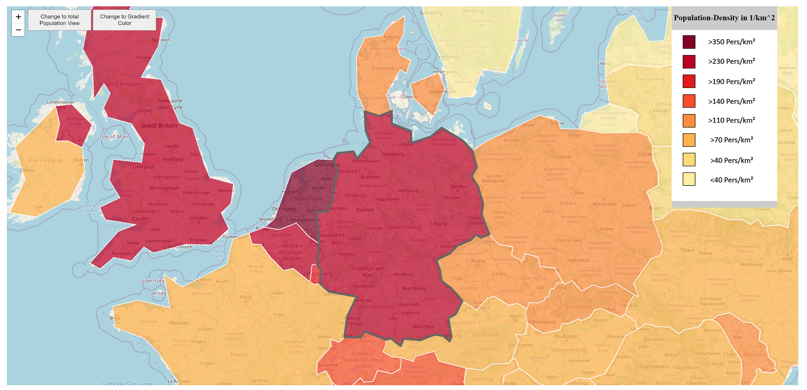
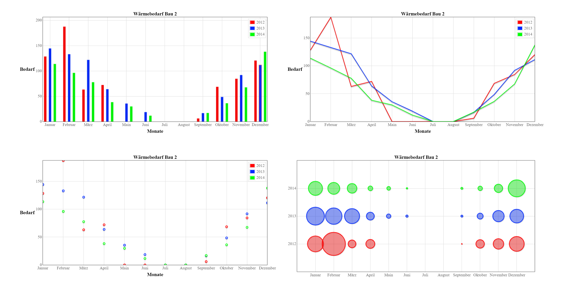
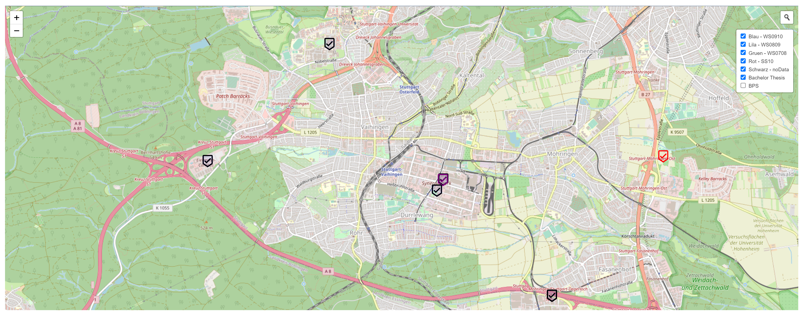

# Leaflet Geo-Visualization

These projects are objects to practice the usage of visualization. The most things are written with HTML, JavaScript and
CSS. The most used library is [Leaflet](https://leafletjs.com/).

__Additional member of the original projects:__

* [Florian Grabowski](https://github.com/FlorianGrabowski)
* [Christoph Walcher](https://github.com/wiomoc)

__Development Requirements:__

* `NodeJS` and `NPM`: https://nodejs.org/en/download/

__Docker Container:__

Build: `docker build -t visualization . `

Run: `docker run -d -p 8080:80 visualization`

## Choropleth Map

Project to display the population density. A short german description is below, just copy/paste it into a translator.
Additional another file is provided with an extended german [documentation](.documentation/choropleth-map-documentation-ger.pdf).

__German description:__

Bei dieser Aufgabe haben wir die Implementierung als Online-Karte gewählt. Wir bezogen die Daten
der `aufgabe1_resources/europe.geo.json` von https://geojson-maps.ash.ms/ .

Um diese als Choroplethenkarte darzustellen haben wir mit den Layers gearbeitet und die ausgewählten Länder
hervorgehoben.

Wir haben die `Bevölkerungsdichte` und die `gesamte Bevölkerung` visualisiert (wechselbar über einen Button). Zusätzlich
haben wir einen Button hinzugefügt, mit dem man zwischen einem "genauen" (nach 100 Graustufen eingeteilten) Farbschema
und einem Farbschema mit 8 Klassen (zur besseren farblichen unterscheidung) entscheiden kann.

Welche Daten ausgewählt sind und mit welchem Farbschema sie angezeigt werden, kann man der Legende entnehmen.

## Flotr Diagram

Project to display data in different diagrams. Project is extended with a
german [documentation](.documentation/diagram-documentation-ger.pdf).

## Leaflet Marker

Project with some `Marker` sorted into `Layer Groups`.

## Leaflet Marker Points of Interests

Project with some `Marker` on a leaflet map. An improved version of the previous project. Additional to the description
below, there is another file with an extended german [documentation](.documentation/choropleth-map-documentation-ger.pdf).

__German description:__

In dieser Aufgabe wurden folgende Points of Interests dargestellt:

| Lernen         | Essen & Trinken     | Öffentlicher Nahverkehr        | Parks                | Einkaufen        |
|----------------|---------------------|--------------------------------|----------------------|------------------|
| Uni Bibliothek | Mensa               | Hauptbahnhof                   | Schlossplatz         | Rewe Boschareal  |
| HFT Bibliothek | Block 4             | U-Bahn Haltestelle Börsenplatz | Oberer Schlossgarten | Lidl Boschareal  |
|                | Palast der Republik | U-Bahn Haltestelle Liederhalle | Stadtgarten          | Teegut Königsbau |
|                | Fritty Bar          |                                |                      |                  |

Die verschieden Marker wurden zu `layerGroups` hinzugefügt, um sie gruppiert ein- und auszublenden.

## Pages

### Choropleth Map

### Flotr2 Diagrams

### Leaflet Layered Markers

### Leaflet POIs

